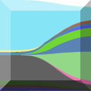
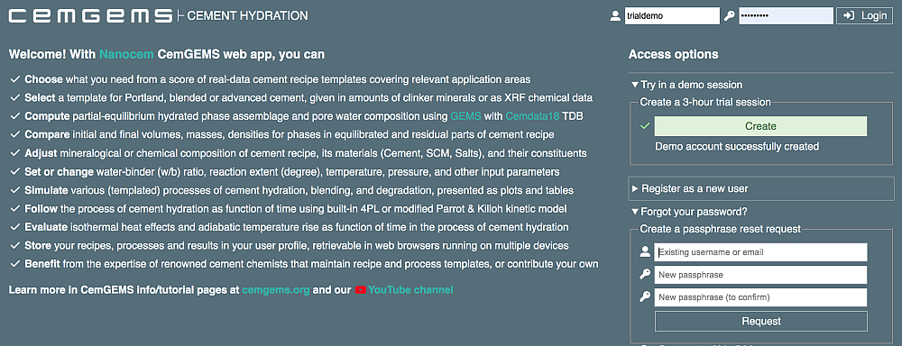
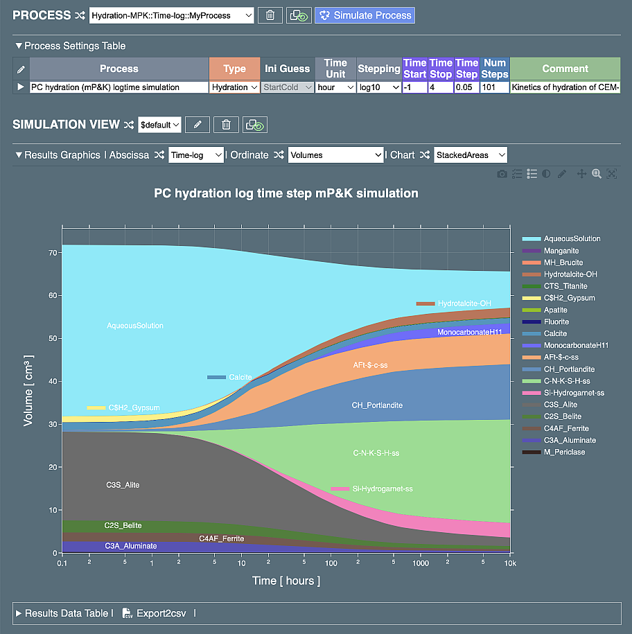

#  CemGEMS 

CemGEMS is a free-to-use web application designed to assist cement chemists, students, and industrial engineers in performing and visualizing thermodynamic simulations of cement hydration and degradation processes. CemGEMS utilizes the GEM-Standalone (xGEMS) code alongside the PSI/Nagra and Cemdata18 chemical thermodynamic databases to deliver accurate and reliable results. ​

The platform offers a selection of real-data cement recipe templates, enabling users to model various cement types and their interactions. Its user-friendly interface simplifies complex thermodynamic modeling, making it accessible for both educational and professional applications. ​

For more information, comprehensive tutorials users can visit the [:octicons-arrow-right-24: CemGEMS official website. ](https://cemgems.org/)

- <figure markdown="span">
  { width="350" }
- <figure markdown="span">
   volumes for OPC cement¶"){ width="350" }
- <figure markdown="span">
  { width="350" }

