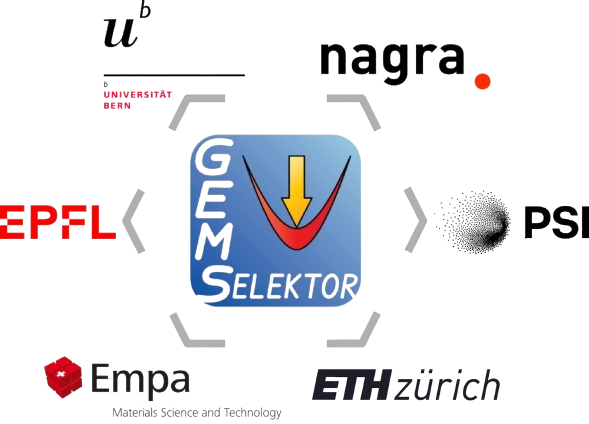

# GEMS Support Consortium

 

&nbsp; &nbsp; &nbsp; &nbsp; &nbsp; &nbsp; { width="400" align=center }  

GEMS Support consortium was established to ensure the continued basic development, maintenance, and support of GEMS codes and its associated thermodynamic databases. 

## Members

| Institution        | Representatives                         |
| ---------- | ------------------------------------    |
| [EMPA](https://www.empa.ch/web/s308)     | [Prof. Barbara Lothenbach](https://www.empa.ch/web/s308/barbara-lothenbach)   Head Group Cement Chemistry and Thermodynamics   [Prof. Pietro Lura](https://www.empa.ch/web/s308/pietro-lura)   Head of Laboratory, Concrete and Asphalt |
| [EPFL](https://www.epfl.ch/labs/lmc/)     | [Prof. Karen Scrivener](https://people.epfl.ch/karen.scrivener)   Head of the Laboratory of Construction Materials LMC |
| [ETHZ](https://baug.ethz.ch/en/)     | [Prof. Ueli Angst](https://ifb.ethz.ch/durability/people/uangst.html)   Department of Civil, Environmental and Geomatic Engineering   [Prof. Dr. Robert Flatt](https://ifb.ethz.ch/pcbm/people/robert-flatt.html)   Department of Civil, Environmental and Geomatic Engineering |
| [Nagra](https://nagra.ch/)    | [Dr. Olivier X. Leupin](https://www.researchgate.net/profile/Olivier-Leupin)   [Dr. Raphael Wüst](https://rocketreach.co/raphael-wust-email_87177391) |
| [UBern](https://www.geo.unibe.ch/research/mineralogy/index_eng.html)    | [Prof. Sergey Churakov](https://www.geo.unibe.ch/about_us/the_institute/personen/prof_churakov_sergey/index_eng.html)   Head of Institute of Geological Sciences |
| [PSI](https://www.psi.ch/en/nes)      | [Dr. George-Dan Miron](https://www.psi.ch/de/les/people/george-dan-miron)   Scientist in the Laboratory of Waste Management LES   [Prof. Andreas Pautz](https://www.psi.ch/de/nes/organisational-structure)   Head of Center for Nuclear Engineering and Scineces NES |

The Consortium Board composed out of one representative per member meets at least once per year to agree on the development tasks and priorities. 

## Board Meetings 2026

- TBA

## Board Meetings 2025

- 2nd of December 2025 
- 21st of February 2025

For more information contact the consortium Coordinator: Dr. George-Dan Miron (dan.miron@psi.ch)

