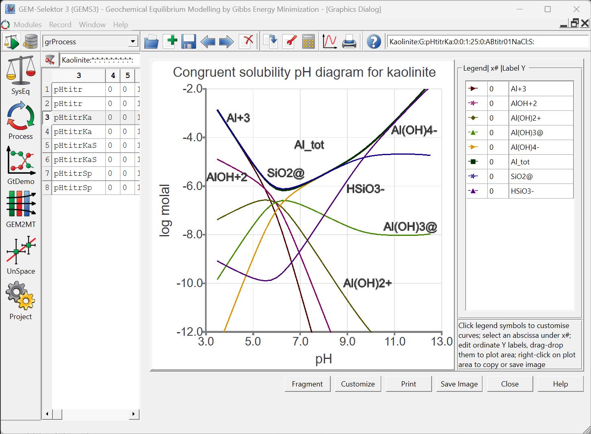
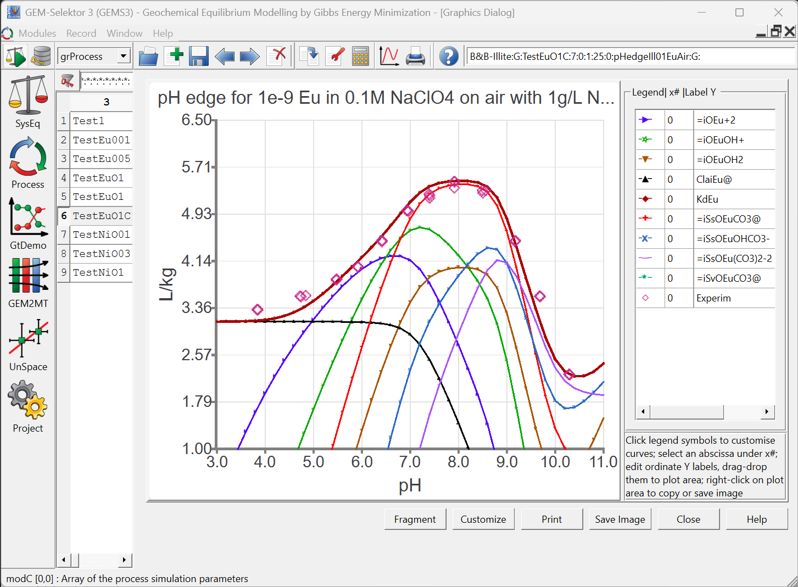
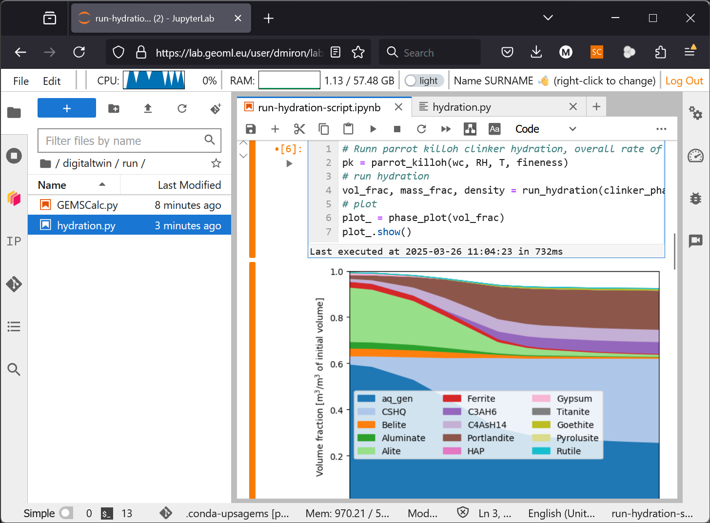
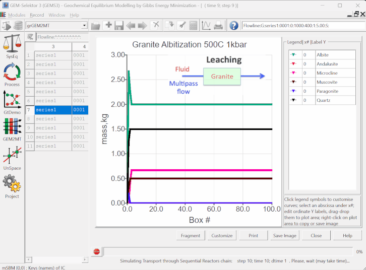

#  GEMS: Gibbs Energy Minimization Software for Geochemical Modeling 

- [:material-download-circle: __Getting Started__ ](start)
- [:material-comment-account-outline: __Community Support__ ](community)
- [:material-github: __Source Code__ ](https://github.com/gemshub)

<!--  -   [:material-comment-account-outline: __Community Support__ ](community) 

    Ask questions, learning materials...

    [:octicons-arrow-right-24: Getting started](#) -->

<!-- - [:fontawesome-solid-quote-left: __Citing__ licenses and conditions](citing_terms)
- [:fontawesome-solid-newspaper: __News__ on development](news) -->

- [x] **GEMS** calculates the equilibrium state of a chemical system by **minimizing its Gibbs free energy**. This is coupled with detailed **models of solid, liquid/aqueous, and gas phase** behavior to ensure accurate descriptions of **complex natural and engineered chemical systems**. These can involve many (non)ideal solid or liquid solutions, gas mixture or non-ideal gaseous fluids.

- [x] **GEMS** along with its related **codes and thermodynamic databases**, are essential scientific tools for **thermodynamic modeling of chemical processes**, including among others **aqueous speciation, solid-gas-liquid interactions, mineral dissolution/precipitation, reaction kinetics, oxidation/reduction, and sorption processes**. 

- [x] **GEMS** enables students, scientists, and engineers to learn and improve modeling skills, predict system behavior, optimize processes, and **solve challenges in geochemistry, environmental science, waste disposal, material science, and chemical engineering**.

# A few of many types of calculations {align="center"}

- <figure markdown="span">
  { width="400" }
</figure>
- <figure markdown="span">
  "){ width="400" }
</figure>
- <figure markdown="span">
  { width="400" }
</figure>
- <figure markdown="span">
  "){ width="400" }
</figure>
- <figure markdown="span">
  { width="400" }
</figure>
- <figure markdown="span">
  { width="400" loading=lazy }
</figure>

* * *

GEM Software is always under development (as indicated in the [Newsticker](news)). [Terms and Conditions of Use](citingterms#terms-and-conditions-of-use). Archived [GEMS PSI website](https://gems.web.psi.ch/index-old.html).
