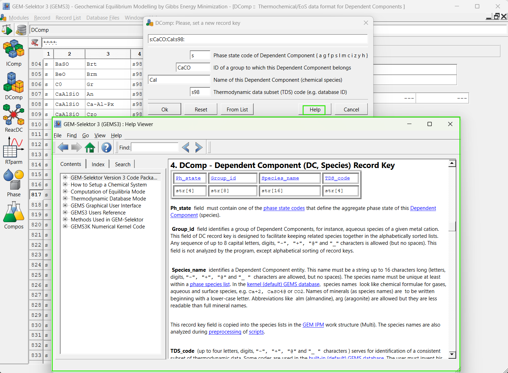
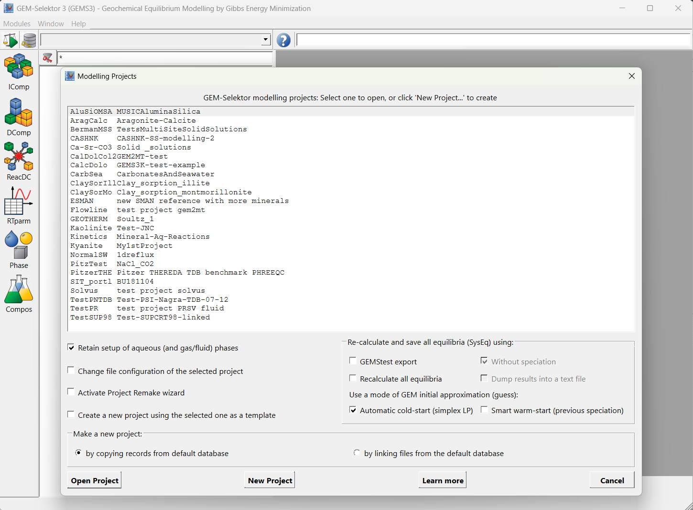

#  GEM-Selektor: Documentation

To start working with GEM-Selektor and perform exciting geochemical calculations, you'll need to familiarize yourself with the graphical user interface. Frequent tasks include:

1. **Creating a Modeling Project:**
    - Open GEM-Selektor and click on "New Project" in the Modeling Projects window.
    - Name your project and select the appropriate thermodynamic database.
    - Choose your system components, relevant elements, to automatically include relevant phases in your project.

2. **Performing Process Calculations:**
    - Use the built-in tools to simulate various geochemical processes, such as dissolution, precipitation, sorption, fluid-rock interactions, cooling, fluid mixing, and leaching.
    - You can model reaction paths, titrations, and other mass-transfer processes by setting up the system's bulk composition and constraints.

3. **Making Changes to Thermodynamic Data:**
    - Modify the [thermodynamic database](../databases) by adding or removing species and phases relevant to your specific project.
    - Ensure that the changes are reflected in your project's calculations by updating the database files in the appropriate folder.

## Important folders 

When working with GEM-Selektor two folder locations are important: 

(**1**) **GEMS Program folder** containing the executable code, the default database files, and resources. Here you find the `DB.default` folder where you need to copy any third-party databases you plan to use to create new modeling projects.

(**2**) **GEMS Projects folder** containing test projects that come with the installation and all user projects. You can exchange projects with others by sending or receiving projects folders.

=== "Windows"
    | Folder Path  &nbsp; &nbsp; &nbsp;                                                 | Description                       |
    | ------------------------------------------------------------- | ------------------------------------    |
    | `C:\'your_user'\` `GEMS3.9.x\Gems3-app\`                         | **Program folder** |
    | `C:\'your user'\` `GEMS3.9.x\Gems3-app\Resources\`               | Resources folder, here you also have the doc folder with documentation **help files** `\doc\html\` |
    | `C:\'your user'\` `GEMS3.9.x\Gems3-app\Resources\DB.default\`    | default databases, these are available when creating a new project. Copy here any third-party database (e.g., cemdata) and you will be able to use it for creating a new project |
    | `C:\'your user'\` `Library\Gems3\Projects\`                      | **Projects Folder**: This is where the test and user projects are stored. To add a shared project, simply copy the project folder here, and it will appear in the Open/New projects list when you open GEM-Selektor. To share your project, zip the folder and send it to someone else. They will need to unzip and copy the project folder into their GEMS projects folder. |
=== "Mac OS X"  
    | Folder Path   &nbsp; &nbsp; &nbsp;                                                | Description                       |
    | ------------------------------------------------------- | ------------------------------------    |
    | `/Applications/` `Gems3.app/Contents/`                          | **Program folder** |
    | `/Applications/` `Gems3.app/Contents/Resources/`                         | Resources folder, here you also have the doc folder with documentation **help files** `/doc/html/` |
    | `/Applications/` `Gems3.app/Contents/Resources/DB.default/`                         | default databases, these are available when creating a new project. Copy here any third-party database (e.g., cemdata) and you will be able to use it for creating a new project |
    | `/Library/` `gems3/projects/`                          | **Projects Folder**: This is where the test and user projects are stored. To add a shared project, simply copy the project folder here, and it will appear in the Open/New projects list when you open GEM-Selektor. To share your project, zip the folder and send it to someone else. They will need to unzip and copy the project folder into their GEMS projects folder. |

=== "Linux"
    | Folder Path         &nbsp; &nbsp; &nbsp;                                          | Description                       |
    | ------------------------------------------------------- | ------------------------------------    |
    | `~/'your_user'/` `GEMS3.9.x/Gems3-app/`                         | **Program folder** |
    | `~/'your user'/` `GEMS3.9.x/Gems3-app/Resources/`               | Resources folder, here you also have the doc folder with documentation **help files** `/doc/html/` |
    | `~/'your user'/` `GEMS3.9.x/Gems3-app/Resources/DB.default/`    | default databases, these are available when creating a new project. Copy here any third-party database (e.g., cemdata) and you will be able to use it for creating a new project |
    | `~/'your user'/` `Library/Gems3/Projects/`                      | **Projects Folder**: This is where the test and user projects are stored. To add a shared project, simply copy the project folder here, and it will appear in the Open/New projects list when you open GEM-Selektor. To share your project, zip the folder and send it to someone else. They will need to unzip and copy the project folder into their GEMS projects folder. |

## Help contents

The most direct way to get information about anything in GEMS is to use its content-aware help interface. This can be accessed from anywhere in the code by pressing F1 (on Mac using the keyboard shortcut Command (⌘) + Shift + ?) or the "Help" button . This will open the **help window with context-specific information about the current window**. 

{ width="600" align=right }  

## Test projects 

{ width="600" align=left } 

The GEM-Selektor comes with a **suite of test modeling projects**. These are included in the GEMS3 installer (see `Gems3-app/Resources/projects/`) and will be automatically copied to the user projects directory (e.g., `/Library/Gems3/projects/`) upon the first installation. The test projects address specific problems and can help you **learn how they were defined, serving as a starting point for your own modeling applications**. Plan to model something similar, you can clone the project, re-name it, and adapt it to your specific system. Before diving too deep into these projects it is expected that you gained some basic knowledge on using GEMS.

## Description of Models

The thermodynamic methods formulations that are available GEMS are described bellow and in files found in the `Gems3-app\Resources\doc\pdf` subfolder of your installed GEM-Selektor folder. 

| File :material-download-circle:                                                   | Description  :material-file-document:                       |
| --------------------------------------------------------------------------------- | ------------------------------------    |
| [**Temperature Corrections**](doc/pdf/T-corrections.pdf)   [**Pressure Corrections**](doc/pdf/P-corrections.pdf)   | Built-in models for temperature and pressure corrections for thermodynamic properties calculated in the GEM-Selektor code from data in DComp records |
| [**Temperature Corrections Reactions**](doc/pdf/T-Corrections-Reac.pdf) | Methods for temperature corrections for thermodynamic properties calculated in the GEM-Selektor code from data in ReacDC records |
| [**Activity models**](doc/pdf/Activity-Coeffs.pdf) | Models for calculation of activity coefficients for aqueous species and solid-solution end-members (with setup codes in Phase records) |
| [**Multisite Mixing models**](doc/pdf/Multisite-Mixmods.pdf) | Models for calculation of activity coefficients and configurational terms for multi-site (sublattice) solid solution models. |
| [**Surface complexation models**](doc/pdf/SCM-corrections.pdf) | Description of setups and built-in calculations related to GEM SCMs (surface complexation models) Will be updated soon with ClaySor model for sorption of cations on clay minerals and clay rocks.   |
| [**Non-electrolyte fluids**](doc/pdf/Tpx-corrections-CG-EoS.pdf) | Contribution by S.V.Churakov: Description of built-in temperature, pressure and composition corrections of molar thermodynamic properties of non-electrolyte fluids and their mixtures.   |
| [**Kinetics**](doc/pdf/Kinetics-Uptake.pdf) | A progress report describing how mineral-water reaction kinetics (with trace element uptake kinetics) can be modelled with GEM-Selektor code. |
| [**Chemical equilibrium**](doc/pdf/GEMS-PSI-paper-2004.pdf) | A short article describing how the chemical equilibrium partitioning can be efficiently modelled with GEM-Selektor code, with special reference to two solid-solution aqueous solution systems relevant to nuclear waste disposal, as well as the status and the perspectives of development of the GEMS. |

## [Workshops and tutorials](../../../community)
Have a look at the schedule for future [workshops](../../../community/workshops) or the available online [recordings](../../../community/workshops#online-workshops-learning-material). There are several materials and tutorials available on how to use GEM-Selektor to model cementitious systems and fluid rock interaction at hydrothermal conditions.

## Discussion
If you have an idea, an example to share [participate in the discussion](../../../community#report-issuesdiscussion).