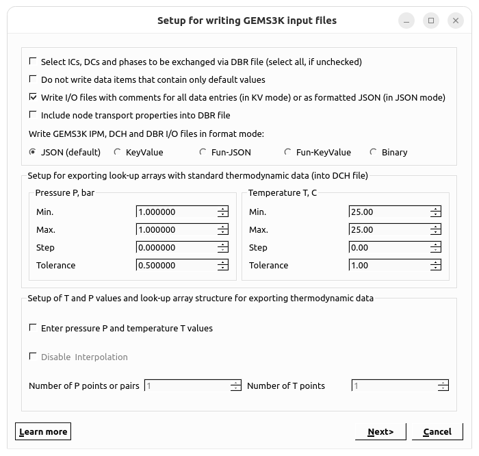

# How to export a chemical system for GEM-Standalone calculations

GEM-Selektor can export any single chemical system (SysEq record) that has already been set up and calculated at least once into a set of GEMS3K input files — one **DCH** (data exchange, chemical system definition), one **IPM** (numerical settings) and one **DBR** (single-node input/output) file. These files can then be read by the standalone GEMS3K code or by a coupled reactive-mass-transport code.

## Starting the export

In the Single System dialog, calculate and save the desired SysEq record, then choose **Data → Export GEMS3K files...**. This opens the **"Setup for writing GEMS3K input files"** dialog, shown below in its default state:

## Upper group — file format options

**Can be left as Default**

- **"Select ICs, DCs and phases to be exchanged via DBR file (select all, if unchecked)"** — an (experimental) option for producing very compact DBR files containing only the items expected to change during standalone/coupled calculations. Normally left unchecked, which exports all ICs, DCs and phases.
- **"Do not write data items that contain only default values"** — produces much smaller IPM and DBR files, since only values differing from defaults are written (GEMS3K assumes defaults for anything missing). Only use this if the GEMS3K version reading the files matches the one used to write them.
- **"Write I/O files with comments for all data entries (in KV mode) or as formatted JSON (in JSON mode)"** — checked by default; if switched off, produces more compact but less human-readable files.
- **"Include node transport properties into DBR file"** — should normally stay unchecked; it is only relevant when the transport part of a coupled code does *not* keep this information itself.
- **"Write GEMS3K IPM, DCH and DBR I/O files in format mode:"** — chooses the on-disk format for all three files: **JSON** (default), **KeyValue**, **Fun-JSON**, **Fun-KeyValue**, or **Binary**.

## Middle group — thermodynamic lookup arrays

The **"Setup for exporting look-up arrays with standard thermodynamic data (into DCH file)"** group configures pressure ("Pressure P, bar") and temperature ("Temperature T, C") iterators used to build a lookup array of thermodynamic data. **This is important** as it determines the T-P interval where you can do the calculations with the GEN-Standalone code.

- With the default single (T, P) point, data is calculated only for the pressure/temperature of the current GEM task.
- For coupled-code runs with variable T and P, a proper lookup array is needed: set wide enough Min/Max pressure and temperature intervals and step sizes to get at least 10 grid points for pressure and 10–40 for temperature (or fewer, keeping the temperature step above roughly 3–5 °C). The **Tolerance** fields define a neighborhood around each grid point within which values are taken directly rather than interpolated.

## Lower group — fine-tuning the T,P grid

- **"Enter pressure P and temperature T values"** — when checked, a second wizard page appears with the actual P and T values generated from the iterators, which can be edited manually before export.
- **"Disable Interpolation"** — changes how the grid is built (grayed out until "Enter pressure P and temperature T values" is checked):
  - **Unchecked (default):** a full `nP × nT` grid is generated and GEMS3K interpolates anywhere within the P–T range. `nP` and `nT` can differ.
  - **Checked:** `nT` is forced equal to `nP`, and only `nP` (T, P) *pairs* are exported. No interpolation is performed — GEMS3K calculations are only valid at those exact (T, P) pairs (within their tolerances).
- **"Number of P points or pairs"** / **"Number of T points"** — show the `nP` and `nT` values that will be generated from the iterators above (1 and 1 in the default single-point case). If different numbers of P and/or T points (>1) are set, the values are auto-generated from Min./Step, and can still be edited on the second page.

A **"Learn more"** button on this dialog links to further documentation.

## Finishing the export

Clicking **Next** proceeds either to the second (T, P) values page described above, or — if the "Enter pressure..." option is off — directly to the standard file dialog where you choose the destination folder for the generated GEMS3K input files.
