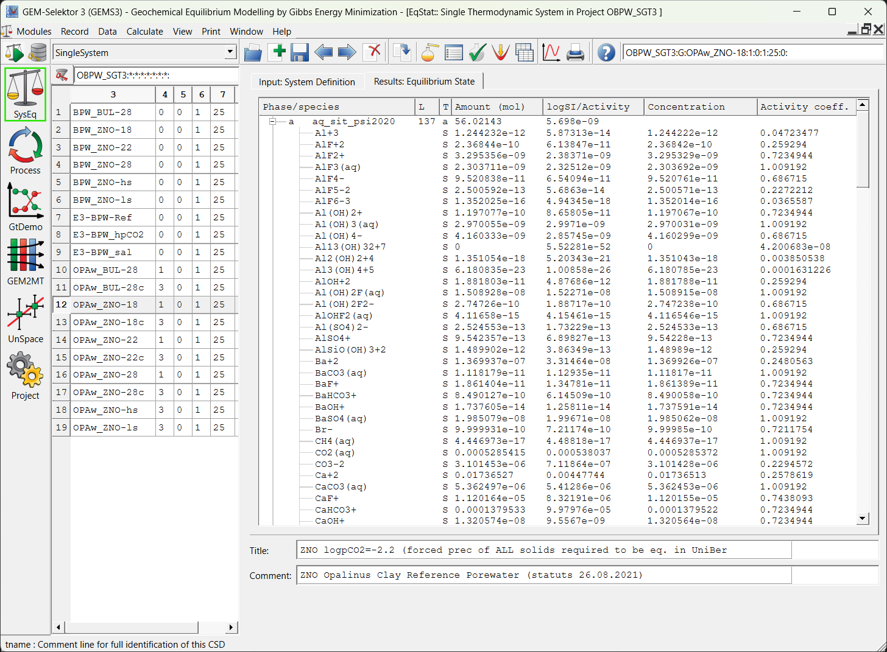
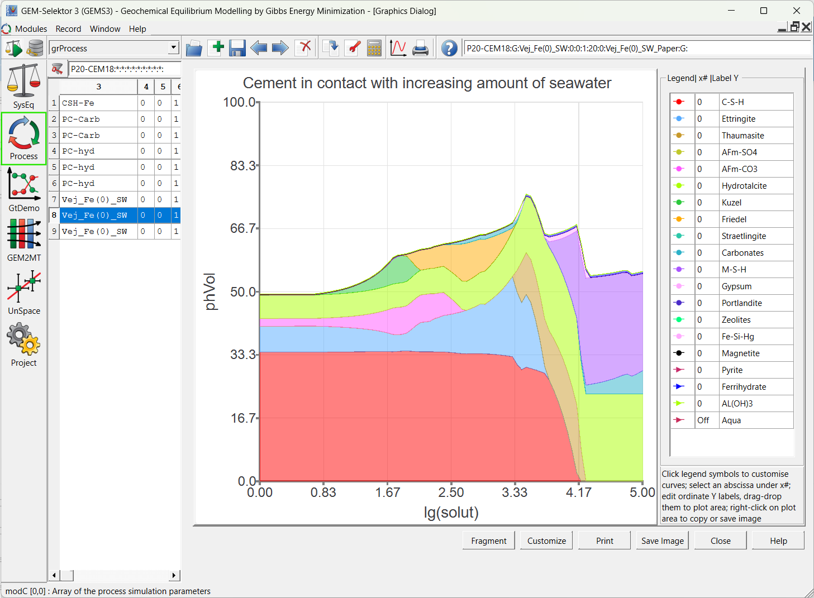
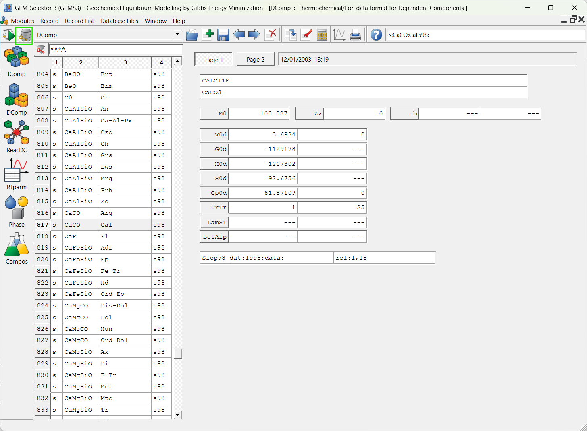

#  GEM-Selektor

**Interactive Package for Thermodynamic Modelling of Aquatic (Geo)Chemical Systems by Gibbs Energy Minimization**. GEMS code package offers high chemical plausibility of (partial) equilibrium thermodynamic models.

- [x] Stable and metastable phases are checked using rigorous criteria based on phase stability index.
- [x] Aqueous equilibria may involve many (non)ideal solid or liquid solutions, gas mixture or non-ideal gaseous fluids.
- [x] Multi-site-surface complexation on mineral-water interfaces can be computed, also without site balances.
- [x] Redox state is calculated from the bulk chemical composition of the system via the GEM dual solution.
- [x] Processes of chemical mass transfer can be simulated using principles of local and partial equilibrium.
- [x] Simple cases of reactive transport (water-rock interaction, 1-D columns) can be simulated in GEM2MT module.
- [x] Built-in default chemical thermodynamic database is provided; third-party databases are also available.
- [x] Thermodynamic data is automatically corrected for temperature and pressure of interest.
- [x] Qt5- based Graphical User Interface with plotting of results and a context-sensitive run-time help system.
- [x] Installers available for all major PC platforms.

To use any GEMS codes, start by creating a modeling project (chemical system) in GEM-Selektor. The complexity of chemical system setup is limited mainly by the availability of thermodynamic data for species and phases.

- <figure markdown="span">
  { width="350" }
- <figure markdown="span">
  { width="350" }
- <figure markdown="span">
  { width="350" }

## Licensing

GEM-Selektor graphical user interface and database package: GNU General Public License (GPL) v3

The GEM-Seketor package is open-source, distributed under the [GNU General Public License (GPL) v3](https://www.gnu.org/licenses/gpl-3.0.en.html).
It is available free of charge for developers affiliated with non-profit educational and research institutions for educational and research purposes only, subject to the [Terms and Conditions of Use](../../../citingterms) of GEM Software. 
