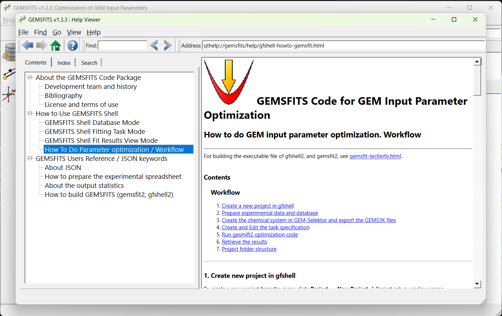

#  GEMSFITS: Documentation

To start working with GEMSFITS and fit parameters of thermodynamic models, you'll need to familiarize yourself with the [GEM-Selektor](../gemselektor) graphical user interface. A prerequisite is to **create a project with the chemical system, including the models and components for which you wish to fit their properties and parameters.**

Frequent tasks include:

1. **Creating a GEMSFITS Project:**
    - Open GEMSFITS and click on **New Project**.
    - Name your project and select the appropriate path in a folder with the same name (the one you created).

2. **Add Experimental Data in a Preformatted Excel File:**
    - Add your experimental data into a preformatted Excel file, export it to CSV, and load it into the GEMSFITS database.
    - You can describe various types of experiments, such as solubility, sorption, and multiple measured properties.

3. **Creating Fitting Tasks and Running Them:**
    - Create template fitting tasks using the GEMS chemical system files. Choose which experiments to use in the fit, which measured properties to compare with the calculated ones, and which parameters to fit (with set upper and lower bounds).
    - Run the fits and explore the results with simple plotting tools. Save the results in the database for each task.

## Important folders 

When working with GEMSFITS two folder locations are important: 

(**1**) **GEMSFITS Program folder** containing the executable code, and the test projects

(**2**) **GEMSFITS Projects folder** containing user projects. GEMSFITS does not have a specific path to the projects folder and by default is the `Tests` folder inside the GEMSFITS program folder (the path you see when clicking open project can be changed from the `Help->Preferences` in the menu). You can exchange projects with other by sending or receiving projects folders.

=== "Windows"
    | Folder Path  &nbsp; &nbsp; &nbsp;                                                 | Description                       |
    | ------------------------------------------------------------- | ------------------------------------    |
    | `C:\'...'\` `GEMSFITS1.x.x\gemsfits-app\`                         | **Program folder** |
    | `C:\'...'\` `GEMSFITS1.x.x\Resources\`               | Resources folder, here you also have the doc folder with documentation **help files** `\doc\html\` |
    | `C:\'...'\` `GEMSFITS1.x.x\Resources\fit-task-json-examples-to-use` | JSON code fragments for various fitting options that you can paste and modify in your fitting task  |
    | `C:\'...'\` `GEMSFITS1.x.x\Tests\`    | **Projects Folder**: test projects, examples can be used to keep users projects, these folders can be exchanged between users, PCs |

=== "Linux"
    | Folder Path         &nbsp; &nbsp; &nbsp;                                          | Description                       |
    | ------------------------------------------------------- | ------------------------------------    |
    | `~/'...'/` `GEMSFITS1.x.x/gemsfits-app/`                         | **Program folder** |
    | `~/'...'/` `GEMSFITS1.x.x/Resources/`               | Resources folder, here you also have the doc folder with documentation **help files** `/doc/html/` |
    | `~/'...'/` `GEMSFITS1.x.x/Resources\fit-task-json-examples-to-use`    | JSON code fragments for various fitting options that you can paste and modify in your fitting task  |
    | `~/'...'/` `GEMSFITS1.x.x/Tests/`                      | **Projects Folder**: test projects, examples can be used to keep users projects, these folders can be exchanged between users, PCs |

## Help contents

The most direct way to get information about anything in GEMSFITS is to use its help interface. This can be accessed from anywhere in the code by pressing `CTRL+H` or the "Help" button . This will open the **help window**. In the Help you will find a work through example workflow, detailed description on how to prepare the experimental data and how to prepare the fitting task for doing parameter optimization. 

{ width="600" align=right }  

## Examples and Test Projects

The GEMSFITS test suite provides a comprehensive set of examples for various parameter optimization problems. These projects serve both as tutorials for learning GEMSFITS and as templates for different types of optimization setups. To get started, users are encouraged to copy-paste relevant sections from the test projects into their own optimization projects, making the necessary modifications.

These test projects are included in the GEMSFITS installer (located in the `/Tests/` folder). Upon installation, the test suite will be automatically copied to the user's test directory. During upgrades, the test folder will be overwritten with the latest version.

To open a test project in GEMSFITS, use the **Open Project...** option and select the `*.pro` file located in the corresponding test folder.

Each test project includes pre-formatted experimental data, which can be found in the `/dbimport/` folder. The associated GEMS3K chemical system files and the GEM-Selektor project files are available in the `/GEMS/` folder for each test example.

It is highly recommended that users use the provided experimental data files as templates and modify them as needed to load their own experimental data into the fitting project.

| **Test Fitting Project**            | **Description**                                                                                                                                 |
| :---------------------------------- | :-------------------------------------------------------------------------------------------------------------------------------------------- |
| **Aqueous-Al**                       | Fitting multiple aqueous species (type F) and reaction-constrained species (type R). Includes a reaction with a logK function of water density.  |
| **Calcite-Strontianite**             | Fitting solid-solution interaction parameters for Calcite-Strontianite against excess Gibbs energy data without full equilibrium calculations.    |
| **CSH-solid-solution**               | Fitting G0 of end members and non-ideal interaction parameters for CSH solid solution, based on measured experimental data.                    |
| **EuSorption**                       | Fitting G0 of sorption sites against partition coefficient (Rd) values measured in experiments, with and without air presence.                 |
| **TestPitzer**                       | Fitting Pitzer interaction parameters against experimental data from Archer et al. (1992), with bounds set at 120% for the initial values.      |
| **Ti-in-Quartz**                     | A. Fitting Ti in quartz solid solution model parameters against experimental data. B. Inverse modeling for determining temperature and pressure of quartz formation based on Ti content. |

## Tutorials

During [*Thermodynamic Modeling of Fluid–Rock Interaction and Ore-Forming Processes*](../../../community/workshops/#geochemical-modeling-of-fluidrock-interaction-using-gem-selektor-and-the-mines-thermodynamic-database) Using GEMS Hosted by the Geochemical Society, December 8–9, 2020. Organizers: Alexander Gysi, Nicole Hurtig, Dan Miron

- ▶️ [Lecture: GEMSFITS and ThermoEcos — Dan Miron](https://youtu.be/acQZ3kyxZRs)

## Discussion
If you have an idea, an example to share [participate in the discussion](../../../community#report-issuesdiscussion).

