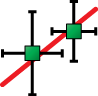

#  GEMSFITS: Download

Please, use an appropriate direct link below to download the actual revision of the package (save the installer archive file to disk):

<div class="grid cards" markdown>

- :material-microsoft-windows: [Download: GEMSFITS for Windows-x64](# "Fetching release...")
- :simple-macos: [Download: GEMSFITS for macOS-intel zip](# "Fetching release...")
- :simple-macos: [Download: GEMSFITS for macOS-dmg](# "Fetching release...")
- :fontawesome-brands-linux: [Download: GEMSFITS for Linux-x64](# "Fetching release...")

</div>

<script>
  const repo = "gemshub/gemsfits";

  const assetPatterns = {
    windows: /^windows-.*\.zip$/i,
    macos_intel_zip: /^macos-.*intel.*\.zip$/i,
    macos_dmg: /^macos-.*\.dmg$/i,
    linux: /^linux-.*\.zip$/i
  };

  // Fetch releases and pick the latest non-draft, non-prerelease release
  fetch(`https://api.github.com/repos/${repo}/releases`)
    .then(res => {
      if (!res.ok) throw new Error(`GitHub API responded with status ${res.status}`);
      return res.json();
    })
    .then(releases => {
      if (!Array.isArray(releases) || releases.length === 0) return;
      const latest = releases.find(r => !r.draft && !r.prerelease) || releases[0];
      const version = latest.tag_name || latest.name || 'latest';
      const assets = latest.assets || [];

      const links = document.querySelectorAll('.grid.cards a');
      const order = [
        'windows',
        'macos_intel_zip',
        'macos_dmg',
        'linux'
      ];

      order.forEach((platform, i) => {
        const pattern = assetPatterns[platform];
        const asset = assets.find(a => pattern.test(a.name));
        if (asset) {
          links[i].href = asset.browser_download_url;
          links[i].title = `Download ${version} for ${platform}`;
          links[i].innerHTML = `Download: GEMSFITS ${version} for ${platform.replace(/_/g, ' ')}`;
        } else {
          // mark as unavailable
          links[i].title = `No asset found for ${platform} in ${version}`;
          links[i].innerHTML = `Not available: ${platform.replace(/_/g, ' ')}`;
          links[i].classList.add('disabled');
        }
      });
    })
    .catch(err => {
      console.error('Error fetching release data:', err);
    });
</script>

**Older versions**

You can find previous GEMSFITS releases at the following links:

- Versions **after 2.0.0**: [Available here](https://github.com/gemshub/gemsfits/releases)
- Versions **prior to 2.0.0**: [Available here](../installpackold)

GEMSFITS for Linux-64 was tested on Ubuntu 20.04.

The Mac OS X variant of GEMSFITS may be provided as an intel build; if you run on Apple Silicon consider using Rosetta or the Linux/Windows builds inside a VM.

## Installing GEMSFITS

Unzip/extract the downloaded package at the desired location (recommended under your user directory).

Some useful operating system based hints are provided in the [technical information below](#technical-information).

!!! note "GEMSFITS projects"

    Modeling projects, including the test projects bundled with the installation, are copied automatically to your projects folder on first start. This folder is not affected by installing, removing, or using a newer GEMSFITS version.

    Users are advised to regularly back up their modeling projects to prevent data loss.

### Technical Information

GEMSFITS is a cross-platform tool built on Qt6.

=== "Windows"

    **How to run GEMSFITS**

    * To run the GEMSFITS application for the first time, double click to execute `runshell.bat` (found at the root of the extracted package).

    !!! warning
        * If Windows shows a warning message **Windows protected your PC**, click "More info" and **Run anyway**. This is only asked the first time.

    !!! info "Pin to taskbar / shortcut"
        Once GEMSFITS is running you can pin the program to the Task bar by right-clicking on its icon (on the task bar) and choosing pin to task bar.

        After you close GEMSFITS, the script creates a Start Menu and Desktop shortcut. After the first run you can always start GEMSFITS using its shortcut.

    * If `runshell.bat` doesn't work for some reason, you can also run `gem-fits-shell.exe` directly from `GemFits-app\bin`. Note that if this machine has another Qt installation (Anaconda, Qt Creator, etc.) that sets a `QT_QPA_PLATFORM_PLUGIN_PATH` or `QT_PLUGIN_PATH` environment variable, GEMSFITS may fail to start that way with `Could not find the Qt platform plugin "windows"`, since `runshell.bat` points those variables at the plugins bundled with the installation before launching, while the raw exe does not.

=== "Mac OS X"

    **How to run GEMSFITS**

    * To run the GEMSFITS application, execute `gem-fits-shell.app`.

    !!! warning "Unidentified developer"

        At the first attempt to start `gem-fits-shell.app`, macOS shows a security alert about an **unidentified developer**, which requires going to Settings / Privacy and Security, scrolling down, and confirming to run `gem-fits-shell.app`.

        Another way to open a blocked app: locate the app in a Finder window, Ctrl-click (or right-click) on it, and select **Open** from the menu — the app will open, and an exception will be created for opening it normally (by double-clicking) in the future.

    The next runs can be started by clicking on `gem-fits-shell.app` in Finder or its icon in the dock.

    * Alternatively you can launch a terminal (in the Finder, open the /Applications/Utilities folder, then double-click Terminal) and execute the following:

    ```sh
    ./runshell.sh
    ```

    * For more details about command line parameters, see into `runshell.sh` (found at the root of the extracted package). Edit the file with any simple text editor in order to ensure that GEMSFITS command line parameters point to the correct locations of the program resources and modeling projects.

=== "Linux"

    **How to run GEMSFITS**

    * To run the GEMSFITS application (Linux x86_64), open a terminal and execute the following:

    ```sh
    ./runshell.sh
    ```

    Ensure that the file is executable by right-click -> Properties -> Permissions "Allow executing file as a program".

    * For more details about command line parameters, see into `runshell.sh` (found at the root of the extracted package). Edit the file with any simple text editor in order to ensure that GEMSFITS command line parameters point to the correct locations of the program resources and modeling projects.

    !!! note "Shortcut / add to application launcher"

        To add the icon for the GEMSFITS application to the launcher, edit the desktop entry file `GemFits-app/share/applications/gem-fits-shell.desktop`, which contains a description of the application including its icon.

        Change the path to the actual location of the `gem-fits-shell` executable (right-click the shortcut, select `Properties`, and update the path).

        The files are typically executable and can be placed in specific directories like `~/.local/share/applications`. Then copy the `share` folder `GemFits-app/share` to `~/.local`.

### Important folders and where to find them

When working with GEMSFITS two folder locations are important:

(**1**) **GEMSFITS Program folder** containing the executable code, the default resources, and bundled test projects.

(**2**) **GEMSFITS Projects folder** containing test projects that come with the installation and all user projects. This folder is fixed at `Library/GemFits/projects` in your user home folder. You can exchange projects with others by sending or receiving project folders.

=== "Windows"
    | Folder Path &nbsp; &nbsp; &nbsp; | Description |
    | --------------------------------- | ------------------------------------ |
    | `...\GemFits-app\bin\` | **Program folder**: contains `gem-fits-shell.exe` (GUI) and `gem-fits.exe` (command line), plus the Qt6 runtime libraries. |
    | `...\GemFits-app\Resources\` | Resources folder, here you also have the doc folder with documentation **help files** `\doc\html\` |
    | `C:\Users\<user>\`</br>`Library\GemFits\projects\` | **Projects Folder**: This is where the test and user projects are stored (not hidden, so it can be opened directly in File Explorer). To add a shared project, copy the project folder here; it will appear in the Open/New projects list when you open GEMSFITS. |
=== "Mac OS X"
    | Folder Path &nbsp; &nbsp; &nbsp; | Description |
    | ------------------------------------ | ------------------------------------ |
    | `gem-fits-shell.app/Contents/MacOS/` | **Program folder**: contains the `gem-fits-shell` and `gem-fits` executables. In Finder, right-click on `gem-fits-shell.app` and choose "Show package contents". |
    | `gem-fits-shell.app/Contents/Resources/` | Resources folder, here you also have the doc folder with documentation **help files** `/doc/html/` |
    | `~/Library/GemFits/projects/` | **Projects Folder**: This is where the test and user projects are stored. macOS hides the `Library` folder by default — press `Cmd+Shift+.` in Finder, or go to `View -> Show View Options` and tick `Show Library Folder`, to see it. |
=== "Linux"
    | Folder Path &nbsp; &nbsp; &nbsp; | Description |
    | ------------------------------------ | ------------------------------------ |
    | `.../GemFits-app/bin/` | **Program folder**: contains the `gem-fits-shell` (GUI) and `gem-fits` (command line) executables. |
    | `.../GemFits-app/Resources/` | Resources folder, here you also have the doc folder with documentation **help files** `/doc/html/` |
    | `~/Library/GemFits/projects/` | **Projects Folder**: This is where the test and user projects are stored (not hidden, so it can be browsed directly with any file manager or terminal). To add a shared project, copy the project folder here; it will appear in the Open/New projects list when you open GEMSFITS. |

## Updating GEMSFITS

Download the newer version and extract it at the desired location.

💡 It's recommended to always use the most recent version for optimal performance. However, you're free to keep multiple versions and choose which one to run as needed.

📁 Note: The projects folder (`Library/GemFits/projects`) is shared across all versions, so your work remains accessible regardless of which version you use.

## Uninstalling GEMSFITS

Delete the installation folder manually from your system.

Remove any desktop shortcuts or Start Menu entries.

✅ Your modeling projects are safe! They remain stored in `Library/GemFits/projects` and won't be affected by the uninstall process.

## Troubleshooting

See also [Frequently Asked Questions](../../../../faq).

If GEMSFITS does not start properly:

*   Check that the paths to the executable and Resources are correct in the shortcut or in `runshell.bat`/`runshell.sh`.

*   On Windows, if launching `gem-fits-shell.exe` directly fails with `Could not find the Qt platform plugin "windows"`, use `runshell.bat` instead — it points the Qt plugin environment variables at the bundled plugins.

*   On Linux, ensure the launch script is executable (`chmod u+x runshell.sh`).

*   Only one instance of GEMSFITS can run in the computer memory. Close the previous instance and start GEMSFITS again.

If this does not help, or you encountered an error, please [report an issue](../../../../community#report-issuesdiscussion) or [contact](/citingterms#contact-gems-development-team) the GEMS Development Team.

[](https://hits.sh/gemshub.github.io/site/start/gemsfits/download/installpack/)
