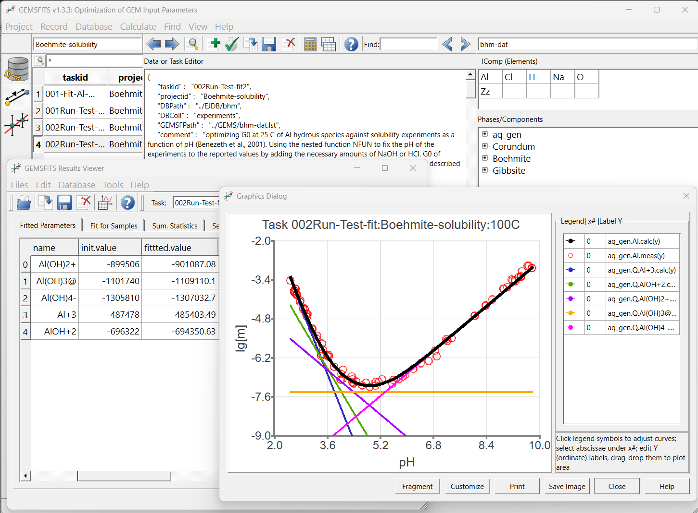
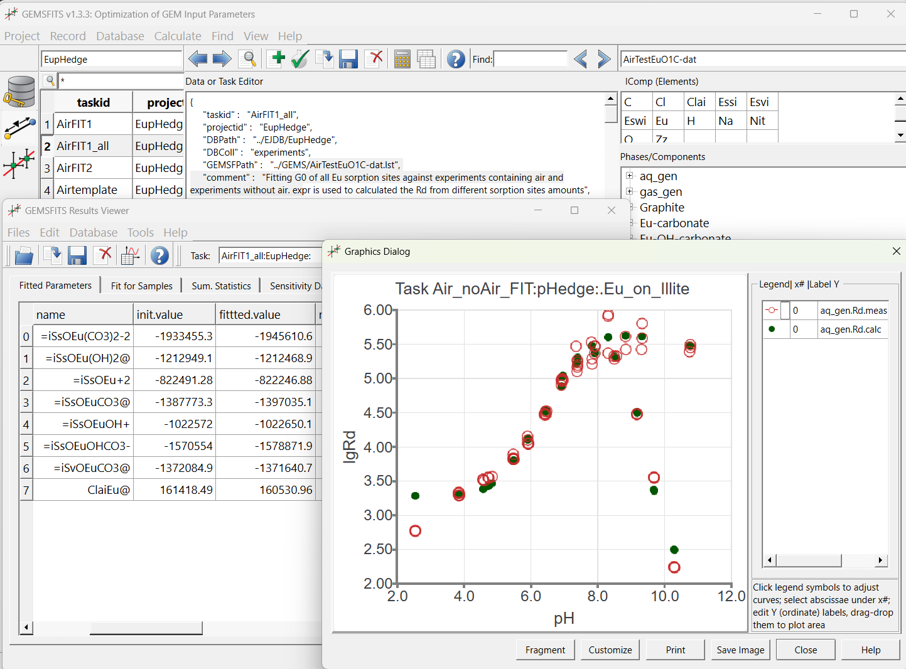
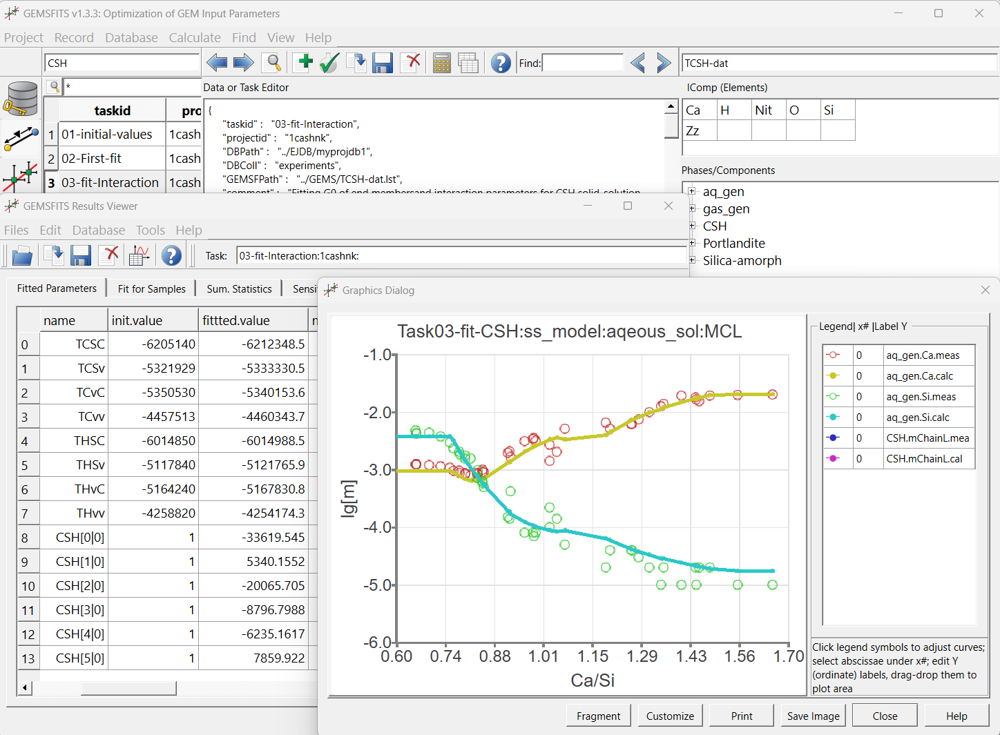

#  GEMSFITS Parameter Optimization and Inverse Modelling

**Codes and Graphical Shell for GEM Input Parameter Optimization and Inverse Modelling**

- [x] **Can fit internally consistent input parameters** of chemical thermodynamic models against experimental data.
  
- [x] **Coupled with the [GEM-Standalone](../gemstandalone)** code for Gibbs Energy Minimization calculation of equilibrium states.

- [x] Uses the [NLOpt](https://nlopt.readthedocs.io/en/latest/) nonlinear optimization library.
  
- [x] Allows for **bound, (non-)linear (in-)equality constrained minimization** of weighted squared residuals.

- [x] **Written in C/C++**, available with source code, and fully parallelizable on HPC architectures.

- [x] Provides **tools for statistical analysis** with thorough evaluation of fitted parameters' uncertainty.
  
- [x] **Results of fitting and statistics** can be visualized and saved in various graphical formats.

- [x] Can **import, manage, and query** extensive sets of experimental data accumulated in [NoSQL](http://ejdb.org) database files.

- <figure markdown="span">
  { width="350" }
- <figure markdown="span">
  { width="350" }
- <figure markdown="span">
  { width="350" }

## GEMSFITS Software Collection

The GEMSFITS software collection consists of:

- **gemsfit2** and **gfshell2** codes, both coupled with the [GEMS3K](../gemstandalone) solver for geochemical equilibria and the [TSolMod](../gemstandalone/solutionmodels) library of >25 models for mixing in multi-component phases.

### gemsfit2

The **gemsfit2** code performs bound, linear, and non-linear (in-)equality constrained optimization of chemical thermodynamic model input parameters against experimental data from the NoSQL database. This guarantees that open-source, state-of-the-art technology is used for data management. It utilizes parts of its early prototype **GEMSFIT** (Hingerl et al., 2014).

- **Nonlinear optimization** is handled by the open-source [NLopt](http://ab-initio.mit.edu/wiki/index.php/NLopt) library, offering several algorithms (global, local, gradient-based).
- **Statistical evaluation** is done by calculating summary statistics, sensitivities, correlation coefficients, and confidence intervals using **Monte Carlo simulations**.
- Computation time is reduced via **parallelization** using Open Multi-Processing (OMP) for computation-intensive tasks.

### gfshell2

The **gfshell2** code is a **Qt-based GUI** ([Qt Project](http://qt-project.org/)) shell that simplifies creating a project for parameter fitting. It allows for:

- Importing data from CSV files and managing experimental data in **JSON** format.
- Creating, modifying, and saving fitting task specifications (in JSON) to project databases.
- Exporting tasks into **gemsfit2** input files, running fitting tasks, and displaying results in **spreadsheet** and **graphical** formats ([Qwt](http://qwt.sf.net/)).
  
In a single GEMSFITS project, multiple fitting tasks (variants) can be created and stored, each with its own setup, allowing the fitting of multiple parameters simultaneously with various options for data weighting, bounds, and statistical methods.

### Experimental Database

Due to the flexibility of the [NoSQL database](http://www.mongodb.com/nosql-explained), any experimental data can be stored, including properties like:

- Composition of chemical systems in each sample
- Measured phase compositions (e.g., solubility data)
- System volume, temperature, and pressure
- Osmotic coefficients, activities/fugacities of components
- Integral properties of mixing

## GEMSFITS License

The GEMSFITS software collection will be released under the **LGPLv3** (Lesser GNU General Public License), and several LGPL'd packages are used as runtime libraries.

## Authors

- **[G. Dan Miron](https://www.psi.ch/de/les/people/george-dan-miron)** (IGP, ETH Zurich, now at PSI LES): Main developer since October 2012, supported by the ETHIIRA PhD project on fitting standard-state thermodynamic properties of aqueous species against experimental solubility data at hydrothermal conditions.

- **[Dmitrii A. Kulik](https://www.researchgate.net/profile/Dmitrii-Kulik)** (retired from [Paul Scherrer Institut](http://www.psi.ch/)): Architect of the GEMSFITS code collection; maintains coupling between gemsfit2 and the GEMS3K kernel equilibrium speciation solver; develops extensions to fit standard-state properties of solid solution end members and reciprocal energies against experimental data (SNF Sinergia C-A-S-H project).

- **Svitlana V. Dmytrieva** (Senior Software engineer, formerly Institute of Environmental Geochemistry, Kyiv, Ukraine): Design and implementation of the **gfshell2 GUI shell** code, data import-export functionality, and graphical visualization.

- **[Thomas Wagner](https://www.rwth-aachen.de/go/id/bdfr/gguid/PER-H6FX4VC)** University professor Department of Earth Sciences and Geography; formerly [IGP](http://www.geopetro.ethz.ch/research/orefluids), ETH Zurich: Maintains coupling between gemsfit2 and the **TSolMod** library of mixing models for phases-solutions.

- **[Georg Kosakowski](https://www.psi.ch/en/les/people/georg-kosakowski)** (Paul Scherrer Institut): Supervises the selection and interaction of statistical methods and parameter fitting algorithms.

The early prototype **GEMSFIT** was developed from 2010 to mid-2012 by:

- **[Ferdinand F. Hingerl](mailto:hingerl@stanford.edu)** (joint position at LES PSI and IGP ETHZ in association with the CCES GEOTHERM project; since August 2012 at [ERE](https://pangea.stanford.edu/departments/ere/), Stanford University, USA).

## Collaborators

- **[Barbara Lothenbach](https://www.empa.ch/web/s308/barbara-lothenbach)** ([Empa](http://www.empa.ch/cemdata), Duebendorf, Switzerland): Optimization of thermodynamic properties for the novel solid solution models of calcium silicate hydrate (C-S-H) phases with aluminum and alkali, supported by the SNF Sinergia C-A-S-H project.

## Publications

1. **Miron G.D., Kulik D.A., Dmytrieva S.V., Wagner T.** (2015): GEMSFITS: Code package for optimization of geochemical model parameters and inverse modeling. *Applied Geochemistry* 55, 28-45. [doi](http://dx.doi.org/10.1016/j.apgeochem.2014.10.013).

2. **Hingerl, F.F., Kosakowski, G., Wagner, T., Kulik, D. A., Driesner, T.** (2014): GEMSFIT: a generic fitting tool for geochemical activity models. *Computational Geosciences* 18, 227-242. [doi](http://dx.doi.org/10.1007/s10596-014-9405-3).

## Licensing

The GEMSFITS code package is open-source, distributed under the [Lesser GPL v.3 license](http://www.gnu.org/copyleft/lesser.html).
It is available free of charge for developers affiliated with non-profit educational and research institutions for educational and research purposes only, subject to the [Terms and Conditions of Use](../citingterms) of GEM Software.