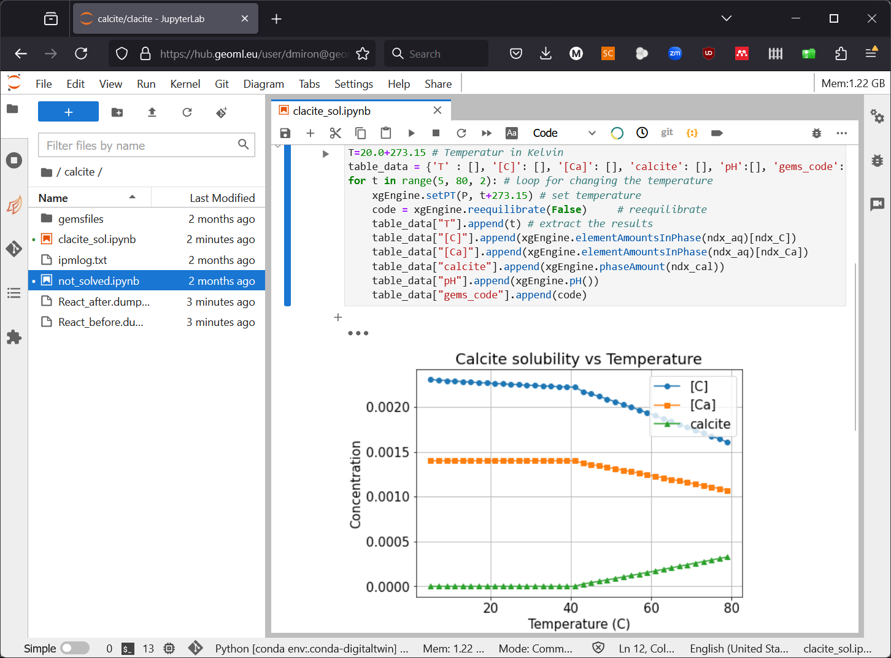

#  GEM-Standalone: Documentation

## New project, export standalone chemical system files

GEM-Standalone Solver of chemical equilibria can be coupled to other simulation codes or used from Python Jupyter notebook through its C++/Python interfaces (GEMS3K node or node array, xGEMS/pyGEMS ChemicalEngine).

!!!info "Export standalone chemical system"

    To work with any GEM-Standalone code you must first use [GEM-Selektor](../../gemselektor) to create a modeling project, having a defined chemical system with respective models and database. Once you are satisfied with the system this can be exported into editable text files (standalone chemical system definition, containing models, parameters, thermodynamic data). These files are then used to initialize any number of GEMS instances in the coupled code ot python script.

    The recommended way to prepare Standalone input files consists in creating a modeling project in [GEM-Selektor](../../gemselektor) package, creating and calculating chemical systems (equilibria), and then exporting the GEM tasks to GEMS3K I/O files. Details about this process can be found in GEMS3K and GEM-Selektor [help files](../../gemselektor/documentation/#important-folders).

## Help Files

The documentation of standalone GEMS3K code consists of HTML files located in the "Docs/html/" folder in the [GEMS3K subversion repository](https://github.com/gemshub/GEMS3K/tree/master/Docs/html). 

## C++/Python ChemicalEngine Interface

xGEMS is built on top of GEMS3K and offers a modern C++/Python interface [`ChemicalEngine`](https://bitbucket.org/gems4/xgems/src/master/xGEMS/ChemicalEngine.hpp) with functions to control the input and output of chemical data for each engine instance. Examples both in C++ and Python can be found in the [code repository](https://bitbucket.org/gems4/xgems/src/master/demos/).

!!!info "Jupyter Notebook Integration"  

    xGEMS through its Python interface enables users to perform single and batch equilibrium calculations within Jupyter notebooks, providing a rich environment for geochemical modeling with advanced statistics, machine learning and plotting libraries. 

In principle any calculation done in GEM-Selektor process module can be implemented in a Jupyter notebook. 

{ width="400" }
{ width="400" }


## C++ Coupling Codes with GEMS3K at the TNode Level  

GEMS3K supports coupling with mass transport codes at the **TNode level**, allowing efficient chemical equilibrium calculations for multiple nodes. The implementation examples `node-gem` and `gemcalc` are available in the [**GEMS3K source code repository**](https://github.com/gemshub/GEMS3K/tree/master).  

### Code Examples  

These refer to GEMS3K I/O Files in 'gemcalc' and 'node-gem' [Examples: Reactive Transport in a Calcite Column](../../../start/gemstandalone/documentation/examples#example-reactive-transport-in-a-calcite-column) 

- **Batch equilibrium calculations**  
    - See [**`standalone/gemcalc/main.cpp`**](https://github.com/gemshub/GEMS3K/blob/master/gemcalc/main.cpp) for an example using **DCH, IPM, and DBR** input files.  
    - Results are stored in **DBR files** or optionally in a **text dump file**.  

- **Coupling with transport codes**  
    - See [**`standalone/node-gem/main.cpp`**](https://github.com/gemshub/GEMS3K/blob/master/node-gem/main.cpp) for an example of integrating GEMS3K with a **multi-node mass transport solver**.  
    - Chemical data and parameters are exchanged dynamically in memory.  

### Performance Optimization  

GEMS3K includes **rescaling mechanisms** that improve **convergence** and **precision** by ensuring equilibrium calculations align with node-specific mass balances.  

- **Mass transport handling**  
    - Transport codes may exchange **aqueous species amounts** instead of **bulk compositions (bIC)**.  
    - To simplify integration, **TNode::GEM_from_MT()** can automatically convert changed **speciation (xDC)** into a corrected **bIC vector** before equilibrium calculations.  

- **Smart Initial Approximation (SIA) mode**

    - GEMS3K can reuse previous speciation and activity coefficients for faster convergence.  
    - Two SIA modes:  
        - **Default (`uPrimalSol = false`)**: Uses the previous equilibrium state as a starting point.  
        - **Optimized (`uPrimalSol = true`)**: Works efficiently when the transport solver directly modifies **xDC** while maintaining mass balance.  

### Input/Output Access  

The **TNode class** provides convenient **access methods** for chemical data, which should be preferred over direct access to internal memory structures.
    
  - Example of function **Ph_Volume(), Ph_Mass(), Ph_BC(), Ph_SatInd()** → Retrieve phase properties for both **multi- and single-component** phases.  

For detailed implementation guidance, refer to the **GEMS3K source code** and documentation in the repository.  

### Data Exchange in Computer Memory  

When coupling GEMS3K with an existing **reactive mass transport code**, data exchange typically occurs via an **intermediate memory structure**. This allows the transport code to manage chemical information (e.g., **speciation, bulk composition**) while interfacing with GEMS3K through a **data bridge (DATABR structure)**.  

### Example Implementation  

The example is provided in:

- **[`standalone/node-gem/main.h`](https://github.com/gemshub/GEMS3K/blob/master/node-gem/main.h)** – Defines the `TMyTransport` class, which holds chemical data for multiple nodes.  
- **[`standalone/node-gem/main.cpp`](https://github.com/gemshub/GEMS3K/blob/master/node-gem/main.cpp)** – Implements `TMyTransport` methods and demonstrates the sequence of `TNode` function calls for coupling mass transport with GEMS3K.  

This example follows the **operator splitting approach**, ensuring modular coupling between mass transport and chemical equilibrium calculations. While it does not include a full transport solver, the `TMyTransport::OneTimeStepRun()` function provides a basic framework that can be extended as needed.  

### Code Snippet: Simplified example of `TMyTransport` Class Definition  

```cpp
class TMyTransport {
public:
    int numNodes;
    std::vector<double> bIC;  // Bulk composition vector for each node
    std::vector<double> xDC;  // Speciation vector for each node
    std::vector<double> temperature, pressure;  

    void Initialize(int nodes);
    void OneTimeStepRun();
};
```
## Discussion
If you have an idea, an example to share [participate in the discussion](../../../community#report-issuesdiscussion).

<!-- Description of examples in node, xgems repository - link to the repository 

think about jupyter examples with mybinder -->